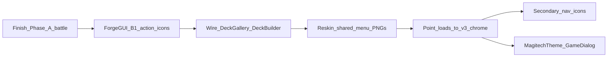

# Magitech v3 — ForgeGUI pipeline

**Primary tool:** [ForgeGUI](https://forgegui.com/) (style lock). **God Mode is retired** for new textured chrome.  

**Troubleshoot:** If output ignores the kit (generic / cartoon UI), style refs likely did not upload — re-attach and confirm they are active before re-rolling.  

**Look:** Holy Tech / Witchhunter Corp — sacred brushed silver + sanctified cyan.  
**Phase A prompts:** [MAGITECH_V3_FORGEGUI_PROMPTS.md](MAGITECH_V3_FORGEGUI_PROMPTS.md) → `battle/v3_magitech/`  
**Style refs:** `assets/textures/ui/magitech_v3/_style_refs/`  
**Phase B exports:** `assets/textures/ui/magitech_v3/chrome/` (then wire in code)  
**Phase C:** Hover shaders — circuit patrol on chrome + once-per-hover metal sheen on context icons (see below)  
**Phase D:** Gradient / circulating borders on dialogs & buttons + animated battle 5×5 grid lines (see below)

## Revertible battle skins

| Command | Skin |
|---------|------|
| `hud_skin v3` | Magitech v3 holytech |
| `hud_skin v2` | Magitech v2 cyan/chrome |
| `hud_skin v1` | Original decorations |

Missing v3 files fall back to v2 → v1 (`HudSkin.gd`). **Default boot is `"v3"`** (`HudSkin.version`). Switch anytime: `hud_skin v1|v2|v3`.

---

## Phase A — Battle HUD (wired)

Core kit in `battle/v3_magitech/` + `HudSkin` / `GameBoard` / `Card` / `BattleCalculationOverlay`.  
Skipped leftovers (fall back): #2 game over, #15 context panel, #17 exposed, #21 options row, #22–23 coins, #25–26 eyes (open is present; closed defers).  
Do **not** expand into Phase B until A is approved in-game.

---

## Phase B — Game-wide chrome actions (planned)

Replace **player-facing** unicode/emoji control icons with holytech PNGs.  
Keep **bluff reaction emojis** as unicode.  
Skip **editor-only** tools (VNEditor, ExplorationEditor, builders) unless you later want a “dev skin.”

### B1 — High priority (menus players hit often)

| ID | Save as | Replaces | Where used today |
|----|---------|----------|------------------|
| B01 | `ui_v3_icon_duplicate.png` | `❐` | Deck Switch Gallery — duplicate deck |
| B02 | `ui_v3_icon_delete.png` | `🗑` | Deck Switch Gallery — delete deck |
| B03 | `ui_v3_icon_close.png` | `✕` / `×` | Overlays close (Protagonist, formations, gallery…) |
| B04 | `ui_v3_icon_featured.png` | `★` | Deck Builder featured star |
| B05 | `ui_v3_icon_remove.png` | `×` on cards | Deck Builder remove-from-deck |
| B06 | `ui_v3_icon_add.png` | `⊕` | Deck Builder add affordance |
| B07 | `ui_v3_icon_scrap.png` | `✂` | Card Gallery scrap / scrap-all |
| B08 | `ui_v3_icon_locked.png` | `🔒` | Campaign gallery locked packs |

### B2 — Shared nav / system (often already PNG — reskin)

| ID | Save as | Replaces / reskins | Where |
|----|---------|-------------------|--------|
| B09 | `ui_v3_icon_setting.png` | `ui_icon_setting.png` | Main menu / settings |
| B10 | `ui_v3_icon_exit.png` | `ui_icon_exit.png` | Main menu exit |
| B11 | `ui_v3_mailbox.png` | `ui_mailbox.png` | Mail |
| B12 | `ui_v3_icon_credit.png` | `ui_icon_credit.png` | Economy / inventory |
| B13 | `ui_v3_icon_compass.png` | `ui_icon_compass.png` | Exploration |
| B14 | `ui_v3_icon_exploration_setting.png` | exploration settings | Exploration HUD |
| B15 | `ui_v3_icon_exploration_info.png` | exploration info | Exploration HUD |
| B16 | `ui_v3_icon_exploration_chat.png` | exploration chat | Exploration HUD |
| B17 | `ui_v3_exploration_inventory.png` | inventory button | Exploration |
| B18 | `ui_v3_icon_magnifier.png` | magnifier | Search / inspect |
| B19 | `ui_v3_campaign_platform_normal.png` | campaign node | Campaign map |
| B20 | `ui_v3_campaign_platform_boss.png` | boss node | Campaign map |

### B3 — Secondary chrome (do after B1–B2)

| ID | Save as | Replaces | Where |
|----|---------|----------|--------|
| B21 | `ui_v3_icon_back.png` | `←` | Back buttons (battle options, exploration) |
| B22 | `ui_v3_icon_expand.png` | `▶` / `▾` | Advanced filters, expand |
| B23 | `ui_v3_icon_collapse.png` | `▼` / `▴` | Collapse |
| B24 | `ui_v3_icon_list.png` | `≡` | Deck gallery list mode |
| B25 | `ui_v3_icon_grid.png` | `⊞` | Deck gallery grid mode |
| B26 | `ui_v3_icon_mail_badge.png` | `[ ✉ ]` | Exploration mail affordance |
| B27 | `ui_v3_icon_formations.png` | `📋` formations | Deck Builder formations entry |
| B28 | `ui_v3_icon_copy.png` | `📋` copy | Only if used in **player** UI (editors stay text) |

### Out of scope for Phase B

| Keep as-is | Why |
|------------|-----|
| Bluff picker emojis | Content / expression, not chrome |
| TECH / VOID / END TURN labels | Phase A battle PNGs |
| VNEditor / ExplorationEditor / builders | Dev tools |
| Card rarity `★` strings | Card data display, not chrome buttons |
| Affinity `⚙` on cards | Card glyph — separate decision later |

---

## Phase B plan (order of work)

1. **Gate:** Phase A battle kit playable via `hud_skin v3`.  
2. **Generate B1** (8 icons) — 128×128, blank sacred-silver + cyan, no baked words except none.  
3. **Wire B1** — `DeckSwitchGallery`, `DeckBuilder`, `CardGallery`, `CampaignGallery`, overlay closes. Prefer one helper e.g. `ChromeIcon.tex("duplicate")` so paths stay centralized.  
4. **Generate B2** — reskin existing decoration PNGs into `magitech_v3/chrome/`.  
5. **Wire B2** — swap `load("…/decorations/…")` / scene ext_resources to v3 chrome (or a small path map like HudSkin).  
6. **B3** only if unicode still sticks out after B1–B2.  
7. **Flats** — MagitechTheme / GameDialog in parallel (not ForgeGUI).

### ForgeGUI rules for Phase B icons

- Style lock: approved `#20` panel + one approved plaque (End Turn / Options).  
- Canvas: **128×128** (campaign platforms **256×256**).  
- Freeform or small hex seal; no faction logos; no text on icon (except none).  
- Destructive (delete/scrap): same silver, slightly warmer/darker void face — not a second rainbow skin.

### Acceptance

- [ ] No `❐` / `🗑` / scrap `✂` / featured `★` unicode on player deck flows  
- [ ] Main menu setting / exit / mailbox match holytech  
- [ ] Editors may still use unicode  
- [ ] Bluff emojis unchanged  

---

## Phase C — Hover shaders (planned)

**Gate:** Phase A battle kit in-game (`hud_skin v3`). Can start after A even if B is unfinished — battle HUD only first.

### C1 — Circuit patrol (chrome buttons)

**Effect:** Fragment shader on hover — a cyan glowing signal “patrols” through the button’s baked V-grooves / cyan seam channels (sample bright/cyan edges in the texture, animate a traveling highlight with `TIME`). Not GPU particles.

| Control | Asset / note |
|---------|----------------|
| TECH stack chip | `ui_magitech_tech.png` |
| VOID stack chip | `ui_magitech_void.png` |
| Union (big center) | `ui_magitech_union.png` |
| End Turn | `ui_magitech_end_turn.png` |
| Options | `ui_magitech_options.png` |
| Eye open / eye closed | `ui_magitech_eye_open.png` / `ui_magitech_eye_closed.png` |

### C2 — Metal reflect sweep (card context menu)

**Effect:** On the card context menu icons (**Attack / Info / Bluff / Union**), **once per hover** — a short **metal specular / sheen** that travels **left → right** across the icon, then dismisses (same feel as a “new item” shine). Does **not** loop while the cursor stays; re-fires only after mouse exit + enter again.

| Icon | Asset |
|------|--------|
| Attack | `ui_magitech_attack.png` |
| Info | `ui_magitech_info.png` |
| Bluff | `ui_magitech_bluff.png` |
| Union (context slot) | `ui_magitech_union.png` |

Wire on the context-menu icon controls in `GameBoard` (where `CTX_ICON_*` are applied).

### Implementation sketch

1. **C1:** `assets/shaders/magitech_circuit_patrol.gdshader` — params: speed, glow color, intensity; idle = identity; hover = animated patrol band.  
2. **C2:** `assets/shaders/magitech_metal_reflect.gdshader` (or shared sheen) — diagonal/vertical band of specular highlight; drive `progress` 0→1 once on `mouse_entered`, then idle; reset arming on `mouse_exited`.  
3. Shared materials / tiny helper; apply only when `HudSkin` is `v3` (v1/v2 stay plain).  
4. Keep modulate/blink (e.g. end-turn tutorial blink) compatible — don’t fight existing tweens.

### Out of scope for Phase C

- Phase B chrome icons  
- Always-on idle patrol / looping sheen while hovered  
- Groove patrol on context icons (C2 is sheen only)

### Acceptance

- [ ] Hover TECH / VOID / Union / End Turn / Options / eyes → cyan groove patrol  
- [ ] Hover Attack / Info / Bluff / Union (context) → one L→R metal sheen, then stop  
- [ ] Sheen re-arms only after mouse leaves and re-enters  
- [ ] Mouse exit → clean stop, no stuck glow/sheen  
- [ ] `hud_skin v1|v2` unchanged  
- [ ] No particle emitters required  

---

## Phase D — Gradient styling + battle grid (planned)

**Gate:** After Phase C hover shader lands (shared shader habits). Can prototype grid or one dialog earlier if needed.

**`GameDialog` stay as-is:** Keep the current flat StyleBox dialog structure/layout — it is already good. **Do not** swap in ForgeGUI `#20` `ui_magitech_panel_9slice.png`. Phase D only adds polish on top of the existing dialog chrome.

**Effect A — `GameDialog` polish (shader / StyleBox only):**
- **Gradient border** — cyan↔silver holytech rim (optional slow circulating variant via `TIME`)
- **Gradient background** — soft dark navy→void fill (not a flat single color), still readable for title/body text  
No 9-slice texture, no ForgeGUI re-bake for dialogs.

**Effect B — battle 5×5 grid lines:** Replace solid `ColorRect` strips in `GameBoard._add_grid_line_panels()` with a **gradient line** (cyan↔silver / soft cyan pulse along the strip) that **loop-animates slowly** (gentle travel / shimmer, not a fast strobe). Outer frame + inner row/column separators on both P1 and P2 grids.

### Targets (first pass)

| Surface | Notes |
|---------|--------|
| `GameDialog` panels | Keep structure; add gradient border + gradient fill only |
| Primary action buttons | Optional matching gradient rim |
| Battle 5×5 grid lines | Both boards; outer + inner separators; slow loop animation |

### Implementation sketch

1. Extend `GameDialog.make_panel_stylebox` / button styles — or a small shader overlay — for gradient fill + gradient rim; params: colors (cyan/silver), speed, `animate` on/off.  
2. Do **not** load `#20` panel 9-slice onto dialogs.  
3. Grid: e.g. `assets/shaders/magitech_grid_line.gdshader` on each strip (or one overlay per board) — 1D gradient along the line + `TIME` offset for slow loop; reuse `battle_grid_border` group + `refresh_grid_borders()`.  
4. Respect `hud_skin` — v3 holytech animated grid / dialog polish; v1/v2 keep current look unless opted in later.

### Out of scope for Phase D

- Wiring `#20` 9-slice into `GameDialog` (explicitly rejected — dialog stays StyleBox-based)  
- Rainbow / purple cyber borders  
- Always-on high-speed spin on every control (keep it sparse)  
- Fast / seizure-risk grid flashing  

### Acceptance

- [ ] `GameDialog` still same layout/structure; gradient border + gradient background only  
- [ ] Text remains readable on gradient fill  
- [ ] Optional circulating rim works without washing out text  
- [ ] 5×5 grid lines: visible gradient + slow seamless loop on both boards  
- [ ] `hud_skin v1|v2` unchanged (unless explicitly enabled)  
- [ ] No ForgeGUI re-gen / no `#20` on dialogs  

## Privacy

Prefer a paid ForgeGUI plan (or disable public catalog) before generating proprietary kit pieces.
