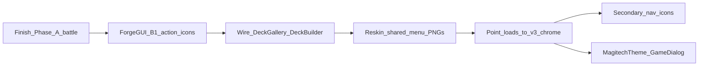

# Magitech v3 — ForgeGUI pipeline

**Primary tool:** [ForgeGUI](https://forgegui.com/) (style lock). **God Mode is retired** for new textured chrome.  

**Troubleshoot:** If output ignores the kit (generic / cartoon UI), style refs likely did not upload — re-attach and confirm they are active before re-rolling.  

**Look:** Holy Tech / Witchhunter Corp — sacred brushed silver + sanctified cyan.  
**Phase A prompts:** [MAGITECH_V3_FORGEGUI_PROMPTS.md](MAGITECH_V3_FORGEGUI_PROMPTS.md) → `battle/v3_magitech/`  
**Style refs:** `assets/textures/ui/magitech_v3/_style_refs/`  
**Phase B:** Game-wide chrome actions (flat silhouettes via `ChromeIcon`). **Approved ✓**  
**Phase B exports (optional later):** `assets/textures/ui/magitech_v3/chrome/` 
**Phase C:** Hover FX — context-icon metal sheen (+ circuit patrol code retained, currently off). **Approved ✓**  

**Phase D:** Gradient message-box + button chrome + animated battle 5×5 grid lines. **Approved ✓**  
**Phase E:** Steampunk stage backdrop (static E00). Modular gears/pistons **cancelled**. **Approved ✓** (user wired)  
**Phase F:** Battle VFX sprites — free CC0 (Kenney + cyan–silver modulate). **Approved ✓**  
**Phase G:** Pre-endgame shake HUD failure + crystal-break art (G01). **Approved ✓** 
**Phase H:** Setup / coin-toss Magitech backdrop (H01). **Approved ✓**  

## Revertible battle skins

| Command | Skin |
|---------|------|
| `hud_skin v3` | Magitech v3 holytech |
| `hud_skin v2` | Magitech v2 cyan/chrome |
| `hud_skin v1` | Original decorations |

Missing v3 files fall back to v2 → v1 (`HudSkin.gd`). **Default boot is `"v3"`** (`HudSkin.version`). Switch anytime: `hud_skin v1|v2|v3`.

---

## Phase A — Battle HUD (approved ✓)

Core kit in `battle/v3_magitech/` + `HudSkin` / `GameBoard` / `Card` / `BattleCalculationOverlay`.  
Skipped leftovers (fall back): #2 game over, #15 context panel, #17 exposed, #21 options row, #22–23 coins, #25–26 eyes (open is present; closed defers).  
**In-game approved** — proceed to Phase B.

---

## Phase B — Game-wide chrome actions (approved ✓)

**In-game approved** — player-facing control icons use flat silhouettes via `ChromeIcon` (`assets/textures/ui/silhouettes/`).  
Keep **bluff reaction emojis** as unicode.  
Skip **editor-only** tools (VNEditor, ExplorationEditor, builders).  
**Prompts:** [MAGITECH_V3_FORGEGUI_PROMPTS.md](MAGITECH_V3_FORGEGUI_PROMPTS.md) → **Phase B** (ForgeGUI Magitech chrome set optional later).  
**Shipped path:** silhouettes + `ChromeIcon` autoload.  
**Optional later:** ornate Magitech icons under `assets/textures/ui/magitech_v3/chrome/`.

### B1 — High priority (menus players hit often)

| ID | Save as | Replaces | Where used today |
|----|---------|----------|------------------|
| B01 | `ui_v3_icon_duplicate.png` | `❐` | Deck Switch Gallery — duplicate deck |
| B02 | `ui_v3_icon_delete.png` | `🗑` | Deck Switch Gallery — delete deck |
| B03 | `ui_v3_icon_close.png` | `✕` / `×` | Overlays close (Protagonist, formations, gallery…) |
| B04 | `ui_v3_icon_featured.png` | `★` | Deck Builder featured star |
| B05 | `ui_v3_icon_remove.png` | `×` on cards | Deck Builder remove-from-deck |
| B06 | `ui_v3_icon_add.png` | `⊕` | Deck Builder add affordance |
| B07 | `ui_v3_icon_scrap.png` | `✂` | Card Gallery scrap / scrap-all |
| B08 | `ui_v3_icon_locked.png` | `🔒` | Campaign gallery locked packs |

### B2 — Shared nav / system (often already PNG — reskin)

| ID | Save as | Replaces / reskins | Where |
|----|---------|-------------------|--------|
| B09 | `ui_v3_icon_setting.png` | `ui_icon_setting.png` | Main menu / settings |
| B11 | `ui_v3_mailbox.png` | `ui_mailbox.png` | Mail |

### B2 deferred / skipped this pass

| ID | Save as | Why |
|----|---------|-----|
| B10 | `ui_v3_icon_exit.png` | Unused — skip |
| B12 | `ui_v3_icon_credit.png` | Skip this pass |
| B13 | `ui_v3_icon_compass.png` | Exploration HUD — later |
| B14 | `ui_v3_icon_exploration_setting.png` | Exploration HUD — later |
| B15 | `ui_v3_icon_exploration_info.png` | Exploration HUD — later |
| B16 | `ui_v3_icon_exploration_chat.png` | Exploration HUD — later |
| B17 | `ui_v3_exploration_inventory.png` | Exploration HUD — later |
| B18 | `ui_v3_icon_magnifier.png` | Skip this pass |
| B19 | `ui_v3_campaign_platform_normal.png` | Campaign map — skip this pass |
| B20 | `ui_v3_campaign_platform_boss.png` | Campaign map — skip this pass |
| B26 | `ui_v3_icon_mail_badge.png` | Exploration mail — later |

### B3 — Secondary chrome (do after B1–B2)

| ID | Save as | Replaces | Where |
|----|---------|----------|--------|
| B21 | `ui_v3_icon_back.png` | `←` | Back buttons (battle options; exploration later) |
| B22 | `ui_v3_icon_expand.png` | `▶` / `▾` | Advanced filters, expand |
| B23 | `ui_v3_icon_collapse.png` | `▼` / `▴` | Collapse |
| B24 | `ui_v3_icon_list.png` | `≡` | Deck gallery list mode |
| B25 | `ui_v3_icon_grid.png` | `⊞` | Deck gallery grid mode |
| B27 | `ui_v3_icon_formations.png` | `📋` formations | Deck Builder formations entry |
| B28 | `ui_v3_icon_copy.png` | `📋` copy | Only if used in **player** UI (editors stay text) |

*(B26 mail badge deferred with Exploration HUD — see B2 deferred.)*

### Out of scope for Phase B

| Keep as-is | Why |
|------------|-----|
| Bluff picker emojis | Content / expression, not chrome |
| TECH / VOID / END TURN labels | Phase A battle PNGs |
| Exploration HUD icons (B13–B17, B26) | Deferred — skip this pass |
| Exit icon (B10) | Unused in game — skip |
| Credit icon (B12) | Skip this pass |
| Magnifier (B18) | Skip this pass |
| Campaign platforms (B19–B20) | Skip this pass |
| VNEditor / ExplorationEditor / builders | Dev tools |
| Admin-only / vault-manager `✕` closes | Leave unicode — not player chrome |
| Card rarity `★` strings | Card data display, not chrome buttons |
| Affinity `⚙` on cards | Card glyph — separate decision later |

---

## Phase B plan (order of work)

1. **Gate:** Phase A battle kit approved ✓ (`hud_skin v3`).  
2. **Generate B1** (8 icons) — 128×128, blank sacred-silver + cyan, no baked words.  
3. **Wire B1** — `DeckSwitchGallery`, `DeckBuilder`, `CardGallery`, `CampaignGallery`, overlay closes. Prefer one helper e.g. `ChromeIcon.tex("duplicate")` so paths stay centralized.  
4. **Generate B2** — reskin existing decoration PNGs into `magitech_v3/chrome/`.  
5. **Wire B2** — swap `load("…/decorations/…")` / scene ext_resources to v3 chrome (or a small path map like HudSkin).  
6. **B3** only if unicode still sticks out after B1–B2.  
7. **Flats** — MagitechTheme / GameDialog in parallel (not ForgeGUI).

### ForgeGUI rules for Phase B icons

- Style lock: approved `#20` panel + one approved plaque (End Turn / Options).  
- Canvas: **128×128** (campaign platforms **256×256**).  
- Freeform or small hex seal; no faction logos; no text on icon (except none).  
- Destructive (delete/scrap): same silver, slightly warmer/darker void face — not a second rainbow skin.

### Acceptance

- [x] Player deck / overlay chrome uses `ChromeIcon` silhouettes (not unicode action glyphs)  
- [x] Editors may still use unicode  
- [x] Bluff emojis unchanged  
- [x] Exploration HUD / campaign platforms / exit / credit / magnifier deferred or skipped as listed  
- [x] In-game approved  
- [x] Ornate ForgeGUI Magitech chrome set (`magitech_v3/chrome/`) — cancelled this pass / optional later  

---

## Phase C — Hover FX (approved ✓)

**In-game approved.** Proceed to Phase D (or parallel E/F).

### C1 — Circuit patrol (chrome buttons) — code retained, **disabled**

Implementation kept in `GameBoard.gd` (`_V3_CIRCUIT_PATROL_ENABLED = false`). Flip to `true` to re-enable after enlarge/settle on TECH / VOID / Union / End Turn / Options / eyes.

### C2 — Metal reflect sweep (card context menu) — **shipped**

Once per hover on Attack / Info / Bluff / Union: L→R sheen via `magitech_metal_reflect.gdshader` on the icon `TextureRect` (alpha-masked — no glow on transparent). Re-arms after mouse exit. Crystal amount labels use the same shader with idle `progress` parked off-UV.

Reckoning metallic deflect clipped to card face only (`BattleCalculationOverlay`).

### Out of scope for Phase C

- Phase B chrome icons  
- Always-on idle patrol / looping sheen while hovered  
- Re-enabling C1 (optional later polish)

### Acceptance

- [x] Context Attack / Info / Bluff / Union → one L→R metal sheen on opaque art only  
- [x] Sheen re-arms only after mouse leaves and re-enters  
- [x] No stuck highlight on crystal amount text  
- [x] C1 circuit patrol code present but off  
- [x] `hud_skin v1|v2` unchanged  
- [x] In-game approved  

---

## Phase D — Gradient styling + battle grid (approved ✓)

**Gate:** Phase C approved ✓.

**`GameDialog` stay as-is:** Keep structure/layout. **Do not** swap in ForgeGUI `#20` 9-slice.

**Shipped approach:**
- Message box: `magitech_dialog_panel.gdshader` on panel (`GameDialog.attach_panel_fx`) — soft fill + cyan↔silver rim  
- Buttons: `magitech_dialog_button.gdshader` on behind-parent `ColorRect` (label stays readable)  
- Grid (v3): `magitech_grid_line.gdshader` on `TextureRect` strips in `GameBoard._add_grid_line_panels` (white tex for real UVs; opaque cyan↔silver + traveling pulse; outer border 4px)  
- GLES3: `//` comments only; no `return` in fragment  

### Acceptance

- [x] Message box: subtle gradient background + border; text readable  
- [x] Dialog buttons: subtle gradient background + border; hover clear  
- [x] 5×5 grid lines: slow gradient loop on both boards (v3)  
- [x] `hud_skin v1|v2` grid unchanged  
- [x] No `#20` on dialogs; no seizure-speed motion  
- [x] In-game approved  

---

## Phase E — Steampunk stage backdrop (approved ✓)

**Gate:** Phase A playmat approved.  

**Shipped:** static steampunk machine stage backdrop (E00) as v3 battle background — **user wired**.  
**Cancelled:** modular gears / pistons / Godot spin-pump `ClockworkLayer` (E01–E08 motion kit).

### Acceptance

- [x] Static E00 steampunk machine chamber behind boards  
- [x] Cards remain readable (quiet center)  
- [x] `hud_skin v1|v2` unchanged  
- [x] No GIF / full playmat video  
- [x] In-game approved  

---

## Phase F — Battle VFX sprites (approved ✓)

**Gate:** Phase A battle kit approved.  
**In-game approved** — Kenney CC0 path shipped; ForgeGUI custom F01–F06 optional later (prompts remain).

**Approach (locked):** **static** PNG + alpha. Godot spawn / rotate / drift / fade.  
**Ship path:** free **CC0 Kenney** assets vendored under `battle/v3_magitech/vfx/`, tinted cyan–silver in Godot (`modulate`).

### F1 — Vendored kit (Kenney CC0)

Save under `assets/textures/ui/battle/v3_magitech/vfx/`. License: `LICENSE_KENNEY.txt`.

| ID | Save as | Source (Kenney) | Role |
|----|---------|-----------------|------|
| F01–F02 | `ui_magitech_vfx_smoke_a/b.png` | whitePuff04 / 18 | Soft / denser puff |
| F01+ | `ui_magitech_vfx_smoke_c…h.png` | whitePuff00/08/12/16/21/24 | Extra white shapes |
| F01 soot | `ui_magitech_vfx_smoke_soot_a/b/c.png` | blackSmoke00/08/16 | Dark soot plumes |
| F03 | `ui_magitech_vfx_bolt_a.png` | Particle Pack · trace_02 | Streak / arc |
| F04 | `ui_magitech_vfx_bolt_b.png` | Particle Pack · trace_05 | Streak variant |
| F05 | `ui_magitech_vfx_fire_spark_a.png` | Particle Pack · spark_05 | Hot spark mote |

Spawn helper randomizes texture, flip, rotation, aspect stretch, and peak opacity per puff.

### F2 — Godot wiring

1. v3: textured smoke/sparks/bolts in union short-circuit + related spawners (dashboard / crystal short).  
2. Also: card destroy fire sparks, union landing sparks/dust, dissolve/dense/turn/HUD-collapse smoke.  
3. Cyan–silver (smoke/bolts) and warm amber (fire spark) via `modulate`.  
4. `hud_skin v1|v2`: procedural ColorRect/Panel fallbacks.  
5. Preserve scatter counts, delays, z-index.

### Acceptance

- [x] Kenney CC0 PNGs vendored under `vfx/` + license note  
- [x] v3 short-circuit / vent / dashboard / crystal short use textured smoke/sparks with tint  
- [x] v3 destroy sparks + union landing sparks/dust use Kenney textures (no hand-crafted particle geometry)  
- [x] Cards and overlays stay readable; z-order unchanged in spirit  
- [x] `hud_skin v1|v2` unchanged (procedural fallback)  
- [x] No full-screen VFX video required  
- [x] In-game approved  

---

## Phase G — Crystal break + pre-endgame HUD failure (approved ✓)

**Gate:** Phase A crystal HUD approved.  
**In-game approved** — G0 shake failure + G01 crystal-break plate shipped. Optional shards G02–G03 cancelled this pass.

### G0 — Pre-endgame shake HUD failure (shipped)

Wired in `GameBoard` at flip-reveal shake start/stop (`_start_pre_endgame_shake_fx` / `_stop_pre_endgame_shake_fx`):

1. Attack count badge **art** hidden immediately; both players’ count labels tick random error glyphs  
2. Top dashboard strip: short-circuit **sparks + smoke** on both sides + electric jolt SFX (`sfx_electric_short_circuit`)  
3. Both players’ **crystal amounts** tick random error glyphs  
4. When shake ends: crystal amounts lock to `----`; attack count stays hidden  

### G1 — Crystal-break art (ForgeGUI → PNG + alpha)

**When (locked):** During the **pre-endgame shake**, optionally reinforce with Magitech **crystal-break** art over the depleted player’s crystal zone (if loss was crystal depletion).  
**Not:** a replacement for depletion vent smoke; not a full-screen shatter movie.

Save under `assets/textures/ui/battle/v3_magitech/vfx/`.  
Prompts: [MAGITECH_V3_FORGEGUI_PROMPTS.md](MAGITECH_V3_FORGEGUI_PROMPTS.md) → **Phase G**.

| ID | Save as | Role | Size | Motion in Godot |
|----|---------|------|------|-----------------|
| G01 | `ui_magitech_vfx_crystal_break.png` | Shattered / cracking cyan crystal relic (hero piece) | 512×512 | Punch-in + crack hold + fade / shard drift |
| G02 | `ui_magitech_vfx_crystal_shard_a.png` | Small flying shard fragment | 128×128 | Scatter + fade (optional multi-spawn) |
| G03 | `ui_magitech_vfx_crystal_shard_b.png` | Shard variant | 128×128 | Scatter + fade |

**Shipped:** G01 alone. G02–G03 optional shards — **cancelled** this pass.

### G2 — Godot wiring (after assets land)

1. On crystal depletion → `0`, immediately play G01 break plate + short-circuit explosion/SFX at that player’s crystal (`_play_crystal_break_explosion`).  
2. Plate stays through pre-endgame shake (jitters with shake), then fades before win/lose screen.  
3. `hud_skin v3` only; v1/v2 skip.  
4. Do **not** hide strip HUD for this — crystal-break sits above the strip widgets (`z_index` high, mouse ignore).

### Style lock for Phase G

- Match existing Magitech crystal (`ui_magitech_crystal.png` / `#6`) — same cyan facets + sacred silver claw language, but **broken / fractured**.  
- Transparent outside; readable silhouette; no text, logos, crests, watermark.  
- Holytech failure — cracked relic / engine-crystal rupture — not cartoon glass smash sticker, not purple neon.

### Out of scope for Phase G

| Skip | Why |
|------|-----|
| Full-screen shatter movie / GIF | Keep readable board + strip HUD |
| Replacing depletion vent smoke | Smoke already covers “engine dying”; break is the gem beat |
| Animating intact crystal HUD permanently | Only the pre-endgame (or depletion) moment |

### Acceptance

- [x] G0: attack badge art hidden at shake start; both attack counts glitch  
- [x] G0: top dashboard sparks + smoke both sides + jolt SFX during shake  
- [x] G0: both crystal amounts glitch during shake; lock to `----` when shake ends  
- [x] G01 `ui_magitech_vfx_crystal_break.png` wired at depleted player’s crystal on pre-endgame shake  
- [x] Optional shards G02–G03 cancelled this pass  
- [x] P1 / P2 placement approved in-game  
- [x] Strip HUD stays visible; break is unclickable overlay  
- [x] `hud_skin v1|v2` unchanged  
- [x] In-game approved  

---

## Phase H — Setup / coin-toss backdrop (approved ✓)

**Gate:** Phase E stage language approved (machinery vocabulary).  
**Owner scripts:** `scripts/SetupPhase.gd`, coin-toss overlay in `scripts/GameBoard.gd`.  
**Skin gate:** `HudSkin.version == "v3"`; v1/v2 keep prior flat navy / solid overlay.

**Shipped:** H01 `ui_bg_setup_phase.png` — theatrical engine-guts stage drop with baked center wiremesh band; wired full-bleed on setup + coin toss (`HudSkin.setup_phase_bg_tex()` crops letterbox padding, then `STRETCH_SCALE`).  
**Cancelled / deferred this pass:** H02 separate wiremesh overlay; setup animated grid lines; setup bluff unicode → PNG (follow-on if needed).

**Prompts:** [MAGITECH_V3_FORGEGUI_PROMPTS.md](MAGITECH_V3_FORGEGUI_PROMPTS.md) → **Phase H** (locked H01 re-roll prompt).

| ID | Save as | Role | Notes |
|----|---------|------|-------|
| H01 | `ui_bg_setup_phase.png` | Full-bleed theatrical stage drop (wall only) | **Approved** — setup + coin toss |
| H02 | `ui_magitech_setup_wiremesh.png` | Distinct wiremesh fence layer | **Cancelled** this pass (mesh baked into H01) |

### Acceptance

- [x] Setup + coin-toss backdrop reads as Magitech machinery bay with wiremesh band  
- [x] Full-bleed stretch (no baked letterbox bars on screen)  
- [x] Cards / placement remain readable; portraits intact  
- [x] `hud_skin v1|v2` unchanged  
- [x] In-game approved  

---

## Privacy

Prefer a paid ForgeGUI plan (or disable public catalog) before generating proprietary kit pieces.
