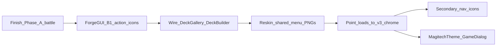

# Magitech v3 — ForgeGUI pipeline

**Primary tool:** [ForgeGUI](https://forgegui.com/) (style lock). **God Mode is retired** for new textured chrome.  

**Troubleshoot:** If output ignores the kit (generic / cartoon UI), style refs likely did not upload — re-attach and confirm they are active before re-rolling.  

**Look:** Holy Tech / Witchhunter Corp — sacred brushed silver + sanctified cyan.  
**Phase A prompts:** [MAGITECH_V3_FORGEGUI_PROMPTS.md](MAGITECH_V3_FORGEGUI_PROMPTS.md) → `battle/v3_magitech/`  
**Style refs:** `assets/textures/ui/magitech_v3/_style_refs/`  
**Phase B exports:** `assets/textures/ui/magitech_v3/chrome/` (then wire in code)  
**Phase C:** Hover FX — context-icon metal sheen (+ circuit patrol code retained, currently off). **Approved ✓**  

**Phase D:** Gradient message-box + button chrome + animated battle 5×5 grid lines. **Approved ✓**  
**Phase E:** Clockwork playmat — modular gears/pistons (ForgeGUI pieces + Godot spin/pump). Prompts in [MAGITECH_V3_FORGEGUI_PROMPTS.md](MAGITECH_V3_FORGEGUI_PROMPTS.md) → **Phase E**  
**Phase F:** Battle VFX sprites — smoke, electric bolt, fire spark (static PNG + alpha; Godot spawns/tweens). Prompts → **Phase F**  
**Phase G:** Pre-endgame shake HUD failure (glitch / dashboard short) + crystal-break art. **G0 code in progress**; art → **Phase G** prompts  

## Revertible battle skins

| Command | Skin |
|---------|------|
| `hud_skin v3` | Magitech v3 holytech |
| `hud_skin v2` | Magitech v2 cyan/chrome |
| `hud_skin v1` | Original decorations |

Missing v3 files fall back to v2 → v1 (`HudSkin.gd`). **Default boot is `"v3"`** (`HudSkin.version`). Switch anytime: `hud_skin v1|v2|v3`.

---

## Phase A — Battle HUD (approved ✓)

Core kit in `battle/v3_magitech/` + `HudSkin` / `GameBoard` / `Card` / `BattleCalculationOverlay`.  
Skipped leftovers (fall back): #2 game over, #15 context panel, #17 exposed, #21 options row, #22–23 coins, #25–26 eyes (open is present; closed defers).  
**In-game approved** — proceed to Phase B.

---

## Phase B — Game-wide chrome actions (in progress)

Replace **player-facing** unicode/emoji control icons with holytech PNGs.  
Keep **bluff reaction emojis** as unicode.  
Skip **editor-only** tools (VNEditor, ExplorationEditor, builders) unless you later want a “dev skin.”  
**Prompts:** [MAGITECH_V3_FORGEGUI_PROMPTS.md](MAGITECH_V3_FORGEGUI_PROMPTS.md) → **Phase B**.  
**Quick-win silhouettes (wired):** `assets/textures/ui/silhouettes/` via `ChromeIcon` autoload.  
**Future Magitech chrome (optional):** `assets/textures/ui/magitech_v3/chrome/`

### B1 — High priority (menus players hit often)

| ID | Save as | Replaces | Where used today |
|----|---------|----------|------------------|
| B01 | `ui_v3_icon_duplicate.png` | `❐` | Deck Switch Gallery — duplicate deck |
| B02 | `ui_v3_icon_delete.png` | `🗑` | Deck Switch Gallery — delete deck |
| B03 | `ui_v3_icon_close.png` | `✕` / `×` | Overlays close (Protagonist, formations, gallery…) |
| B04 | `ui_v3_icon_featured.png` | `★` | Deck Builder featured star |
| B05 | `ui_v3_icon_remove.png` | `×` on cards | Deck Builder remove-from-deck |
| B06 | `ui_v3_icon_add.png` | `⊕` | Deck Builder add affordance |
| B07 | `ui_v3_icon_scrap.png` | `✂` | Card Gallery scrap / scrap-all |
| B08 | `ui_v3_icon_locked.png` | `🔒` | Campaign gallery locked packs |

### B2 — Shared nav / system (often already PNG — reskin)

| ID | Save as | Replaces / reskins | Where |
|----|---------|-------------------|--------|
| B09 | `ui_v3_icon_setting.png` | `ui_icon_setting.png` | Main menu / settings |
| B11 | `ui_v3_mailbox.png` | `ui_mailbox.png` | Mail |

### B2 deferred / skipped this pass

| ID | Save as | Why |
|----|---------|-----|
| B10 | `ui_v3_icon_exit.png` | Unused — skip |
| B12 | `ui_v3_icon_credit.png` | Skip this pass |
| B13 | `ui_v3_icon_compass.png` | Exploration HUD — later |
| B14 | `ui_v3_icon_exploration_setting.png` | Exploration HUD — later |
| B15 | `ui_v3_icon_exploration_info.png` | Exploration HUD — later |
| B16 | `ui_v3_icon_exploration_chat.png` | Exploration HUD — later |
| B17 | `ui_v3_exploration_inventory.png` | Exploration HUD — later |
| B18 | `ui_v3_icon_magnifier.png` | Skip this pass |
| B19 | `ui_v3_campaign_platform_normal.png` | Campaign map — skip this pass |
| B20 | `ui_v3_campaign_platform_boss.png` | Campaign map — skip this pass |
| B26 | `ui_v3_icon_mail_badge.png` | Exploration mail — later |

### B3 — Secondary chrome (do after B1–B2)

| ID | Save as | Replaces | Where |
|----|---------|----------|--------|
| B21 | `ui_v3_icon_back.png` | `←` | Back buttons (battle options; exploration later) |
| B22 | `ui_v3_icon_expand.png` | `▶` / `▾` | Advanced filters, expand |
| B23 | `ui_v3_icon_collapse.png` | `▼` / `▴` | Collapse |
| B24 | `ui_v3_icon_list.png` | `≡` | Deck gallery list mode |
| B25 | `ui_v3_icon_grid.png` | `⊞` | Deck gallery grid mode |
| B27 | `ui_v3_icon_formations.png` | `📋` formations | Deck Builder formations entry |
| B28 | `ui_v3_icon_copy.png` | `📋` copy | Only if used in **player** UI (editors stay text) |

*(B26 mail badge deferred with Exploration HUD — see B2 deferred.)*

### Out of scope for Phase B

| Keep as-is | Why |
|------------|-----|
| Bluff picker emojis | Content / expression, not chrome |
| TECH / VOID / END TURN labels | Phase A battle PNGs |
| Exploration HUD icons (B13–B17, B26) | Deferred — skip this pass |
| Exit icon (B10) | Unused in game — skip |
| Credit icon (B12) | Skip this pass |
| Magnifier (B18) | Skip this pass |
| Campaign platforms (B19–B20) | Skip this pass |
| VNEditor / ExplorationEditor / builders | Dev tools |
| Admin-only / vault-manager `✕` closes | Leave unicode — not player chrome |
| Card rarity `★` strings | Card data display, not chrome buttons |
| Affinity `⚙` on cards | Card glyph — separate decision later |

---

## Phase B plan (order of work)

1. **Gate:** Phase A battle kit approved ✓ (`hud_skin v3`).  
2. **Generate B1** (8 icons) — 128×128, blank sacred-silver + cyan, no baked words.  
3. **Wire B1** — `DeckSwitchGallery`, `DeckBuilder`, `CardGallery`, `CampaignGallery`, overlay closes. Prefer one helper e.g. `ChromeIcon.tex("duplicate")` so paths stay centralized.  
4. **Generate B2** — reskin existing decoration PNGs into `magitech_v3/chrome/`.  
5. **Wire B2** — swap `load("…/decorations/…")` / scene ext_resources to v3 chrome (or a small path map like HudSkin).  
6. **B3** only if unicode still sticks out after B1–B2.  
7. **Flats** — MagitechTheme / GameDialog in parallel (not ForgeGUI).

### ForgeGUI rules for Phase B icons

- Style lock: approved `#20` panel + one approved plaque (End Turn / Options).  
- Canvas: **128×128** (campaign platforms **256×256**).  
- Freeform or small hex seal; no faction logos; no text on icon (except none).  
- Destructive (delete/scrap): same silver, slightly warmer/darker void face — not a second rainbow skin.

### Acceptance

- [ ] No `❐` / `🗑` / scrap `✂` / featured `★` unicode on player deck flows  
- [ ] Main menu setting / mailbox match holytech  
- [ ] Editors may still use unicode  
- [ ] Bluff emojis unchanged  

---

## Phase C — Hover FX (approved ✓)

**In-game approved.** Proceed to Phase D (or parallel E/F).

### C1 — Circuit patrol (chrome buttons) — code retained, **disabled**

Implementation kept in `GameBoard.gd` (`_V3_CIRCUIT_PATROL_ENABLED = false`). Flip to `true` to re-enable after enlarge/settle on TECH / VOID / Union / End Turn / Options / eyes.

### C2 — Metal reflect sweep (card context menu) — **shipped**

Once per hover on Attack / Info / Bluff / Union: L→R sheen via `magitech_metal_reflect.gdshader` on the icon `TextureRect` (alpha-masked — no glow on transparent). Re-arms after mouse exit. Crystal amount labels use the same shader with idle `progress` parked off-UV.

Reckoning metallic deflect clipped to card face only (`BattleCalculationOverlay`).

### Out of scope for Phase C

- Phase B chrome icons  
- Always-on idle patrol / looping sheen while hovered  
- Re-enabling C1 (optional later polish)

### Acceptance

- [x] Context Attack / Info / Bluff / Union → one L→R metal sheen on opaque art only  
- [x] Sheen re-arms only after mouse leaves and re-enters  
- [x] No stuck highlight on crystal amount text  
- [x] C1 circuit patrol code present but off  
- [x] `hud_skin v1|v2` unchanged  
- [x] In-game approved  

---

## Phase D — Gradient styling + battle grid (approved ✓)

**Gate:** Phase C approved ✓.

**`GameDialog` stay as-is:** Keep structure/layout. **Do not** swap in ForgeGUI `#20` 9-slice.

**Shipped approach:**
- Message box: `magitech_dialog_panel.gdshader` on panel (`GameDialog.attach_panel_fx`) — soft fill + cyan↔silver rim  
- Buttons: `magitech_dialog_button.gdshader` on behind-parent `ColorRect` (label stays readable)  
- Grid (v3): `magitech_grid_line.gdshader` on `TextureRect` strips in `GameBoard._add_grid_line_panels` (white tex for real UVs; opaque cyan↔silver + traveling pulse; outer border 4px)  
- GLES3: `//` comments only; no `return` in fragment  

### Acceptance

- [x] Message box: subtle gradient background + border; text readable  
- [x] Dialog buttons: subtle gradient background + border; hover clear  
- [x] 5×5 grid lines: slow gradient loop on both boards (v3)  
- [x] `hud_skin v1|v2` grid unchanged  
- [x] No `#20` on dialogs; no seizure-speed motion  
- [x] In-game approved  

---

## Phase E — Clockwork playmat (planned)

**Gate:** Phase A playmat + chrome approved in-game. Can run in parallel with B/C/D.

**Approach (locked):** modular ForgeGUI **pieces** + Godot rotation / piston tweens.  
**Not:** one full animated 1280×720 GIF/video, not AI-video of the whole stage.

Castlevania clocktower feel = layered depth + independent RPM. Keep motion **slow and sparse** behind the card grids so boards stay readable.

### E1 — Asset kit (ForgeGUI → PNG + alpha)

Save under `assets/textures/ui/battle/v3_magitech/clockwork/`.  
Prompts: [MAGITECH_V3_FORGEGUI_PROMPTS.md](MAGITECH_V3_FORGEGUI_PROMPTS.md) → Phase E.

| ID | Save as | Role | Animate in Godot |
|----|---------|------|------------------|
| E00 | `ui_magitech_clockwork_underlay.png` | Far stone / machine wall (static) | No (optional; else keep current playmat) |
| E01 | `ui_magitech_gear_face_lg.png` | Large face-on cog | Spin |
| E02 | `ui_magitech_gear_face_md.png` | Medium face-on cog | Spin |
| E03 | `ui_magitech_gear_face_sm.png` | Small face-on cog | Spin |
| E04 | `ui_magitech_gear_side.png` | Thick side-view / roller gear | Spin on local axis (or fake with scale) |
| E05 | `ui_magitech_piston.png` | Piston head + short rod (isolated) | Vertical pump |
| E06 | `ui_magitech_shaft.png` | Straight sacred-silver shaft / axle | Optional slow drift |
| E07 | `ui_magitech_chain_seg.png` | One chain link / short segment | Optional scroll (later) |
| E08 | `ui_magitech_belt_strip.png` | Short ridged belt tile (tileable X) | Optional scroll (later) |

**Ship-first subset:** E00 (or reuse #1 playmat) + E01–E03 + E05. Add E04/E06–E08 if depth still feels thin.

### E2 — Godot wiring (after assets land)

1. Under `Background` / playmat: a `ClockworkLayer` `Control` with `clip_contents`, z below cards/grids/fog.  
2. Instance ~8–15 gear `TextureRect`s (reuse E01–E03 at different scales/modulate).  
3. Per gear: continuous `rotation` at different RPM (e.g. ±4°/s … ±18°/s).  
4. 1–2 pistons: slow Y ping-pong (1.5–3s).  
5. Far pieces darker / lower alpha; near pieces slightly brighter — fake depth, no camera parallax required.  
6. Mute or pause motion when full-info / reckoning overlays are up (optional polish).  
7. `hud_skin v3` only; v1/v2 keep static playmat.

### Style lock for Phase E

- Materials: blank `#20` panel + approved playmat / end-turn silver (logo-free).  
- Prefer **remove** holytech kit board (crests leak onto gears).  
- No text, logos, crests on any clockwork piece.  
- Magitech silver + thin cyan seams — **not** SotN purple stone flood, not rust-brown only, not mecha.

### Out of scope for Phase E

| Skip | Why |
|------|-----|
| Full-screen loop video / GIF | Size, style drift, unreadable under cards |
| Animated whole-stage AI video | Loses style lock + independent RPM |
| Dense foreground gears over card cells | Cards must stay readable |
| Fast / seizure-risk spin | Keep slow ceremonial grind |
| Replacing top dashboard / bottom vault | Separate chrome; playmat mid only |

### Acceptance

- [ ] Modular PNGs with clean alpha (no baked full stage)  
- [ ] In-game: gears spin, ≥1 piston pumps, cards remain readable  
- [ ] Motion stays behind grids; overlays still above smoke/VFX as today  
- [ ] `hud_skin v1|v2` unchanged  
- [ ] No GIF / full playmat video required for ship  

---

## Phase F — Battle VFX sprites (planned)

**Gate:** Phase A battle kit approved. Can run in parallel with B/C/D/E.

**Approach (locked):** **static** PNG pieces with clean alpha. Godot keeps spawn / rotate / drift / fade (same pattern as today’s procedural `ColorRect` sparks + `Panel` smoke in `GameBoard._spawn_union_short_circuit_*`).  
**Not:** full-screen GIF/video of the whole short-circuit; not one baked composite movie.

### F1 — Asset kit (ForgeGUI → PNG + alpha)

Save under `assets/textures/ui/battle/v3_magitech/vfx/`.  
Prompts: [MAGITECH_V3_FORGEGUI_PROMPTS.md](MAGITECH_V3_FORGEGUI_PROMPTS.md) → **Phase F**.

| ID | Save as | Role | Size | Motion in Godot |
|----|---------|------|------|-----------------|
| F01 | `ui_magitech_vfx_smoke_a.png` | Soft electrical / steam puff (light) | 256×256 | Drift + fade |
| F02 | `ui_magitech_vfx_smoke_b.png` | Soft puff variant (denser / wispy) | 256×256 | Drift + fade |
| F03 | `ui_magitech_vfx_bolt_a.png` | Thin electric bolt / arc (short) | 128×256 | Rotate + streak fade |
| F04 | `ui_magitech_vfx_bolt_b.png` | Longer jagged arc variant | 128×256 | Rotate + streak fade |
| F05 | `ui_magitech_vfx_fire_spark_a.png` | Hot ember / fire spark mote | 128×128 | Pop + fade / short rise |
| F06 | `ui_magitech_vfx_fire_spark_b.png` | Fire spark variant (brighter tip) | 128×128 | Pop + fade / short rise |

**Ship-first:** F01–F02 + F03–F04 + F05 (one fire spark). Add F06 if variety feels thin.

### F2 — Godot wiring (after assets land)

1. Replace procedural spark `ColorRect`s with `TextureRect` / `Sprite2D` using F03–F04 (keep scatter counts, delays, z-index).  
2. Replace procedural smoke `Panel`s with F01–F02 textures (keep edge-drift + lifetime).  
3. Mix in F05–F06 as hotter flecks among the short-circuit (or card-destroy / impact call sites if already sparking).  
4. `hud_skin v3` only; v1/v2 keep procedural fallbacks (or skip VFX swap).  
5. Preserve current z stacking: smoke under overlays; sparks above board as today.

### Style lock for Phase F

- Magitech silver–cyan for smoke/bolts; fire sparks may use warm amber/orange **tips** with cool cyan core or rim so they still read holytech (not cartoon cartoon-fireball).  
- Transparent outside; soft edges on smoke; sharp readable silhouette on bolts.  
- No text, logos, crests, watermark.  
- Single isolated piece per file — not a full-screen effect plate.

### Out of scope for Phase F

| Skip | Why |
|------|-----|
| Animated sprite sheets / GIF loops | Motion stays in Godot for many instances |
| Full-screen short-circuit movie | Style drift + size; cards unreadable |
| Particle `.tres` library redesign | Wire textures into existing spawners first |
| Fog-of-war board fog reskin | Separate system (`_fog_material`) — not this pass |

### Acceptance

- [ ] Smoke / bolt / fire-spark PNGs with clean alpha in `vfx/`  
- [ ] Union short-circuit uses real textures instead of flat ColorRect/Panel blobs  
- [ ] Cards and overlays stay readable; z-order unchanged in spirit  
- [ ] `hud_skin v1|v2` unchanged  
- [ ] No full-screen VFX video required  

---

## Phase G — Crystal break + pre-endgame HUD failure (in progress)

**Gate:** Phase A crystal HUD approved. Can run after / parallel with F (same `vfx/` folder).

### G0 — Pre-endgame shake HUD failure (code landed)

Wired in `GameBoard` at flip-reveal shake start/stop (`_start_pre_endgame_shake_fx` / `_stop_pre_endgame_shake_fx`):

1. Attack count badge **art** hidden immediately; both players’ count labels tick random error glyphs  
2. Top dashboard strip: short-circuit **sparks + smoke** on both sides + electric jolt SFX (`sfx_electric_short_circuit`)  
3. Both players’ **crystal amounts** tick random error glyphs  
4. When shake ends: crystal amounts lock to `----`; attack count stays hidden  

### G1 — Crystal-break art (ForgeGUI → PNG + alpha)

**When (locked):** During the **pre-endgame shake**, optionally reinforce with Magitech **crystal-break** art over the depleted player’s crystal zone (if loss was crystal depletion).  
**Not:** a replacement for depletion vent smoke; not a full-screen shatter movie.

Save under `assets/textures/ui/battle/v3_magitech/vfx/`.  
Prompts: [MAGITECH_V3_FORGEGUI_PROMPTS.md](MAGITECH_V3_FORGEGUI_PROMPTS.md) → **Phase G**.

| ID | Save as | Role | Size | Motion in Godot |
|----|---------|------|------|-----------------|
| G01 | `ui_magitech_vfx_crystal_break.png` | Shattered / cracking cyan crystal relic (hero piece) | 512×512 | Punch-in + crack hold + fade / shard drift |
| G02 | `ui_magitech_vfx_crystal_shard_a.png` | Small flying shard fragment | 128×128 | Scatter + fade (optional multi-spawn) |
| G03 | `ui_magitech_vfx_crystal_shard_b.png` | Shard variant | 128×128 | Scatter + fade |

**Ship-first:** G01 alone is enough for the pre-endgame beat. Add G02–G03 if the break needs extra debris.

### G2 — Godot wiring (after assets land)

1. On crystal depletion → `0`, immediately play G01 break plate + short-circuit explosion/SFX at that player’s crystal (`_play_crystal_break_explosion`).  
2. Plate stays through pre-endgame shake (jitters with shake), then fades before win/lose screen.  
3. `hud_skin v3` only; v1/v2 skip.  
4. Do **not** hide strip HUD for this — crystal-break sits above the strip widgets (`z_index` high, mouse ignore).

### Style lock for Phase G

- Match existing Magitech crystal (`ui_magitech_crystal.png` / `#6`) — same cyan facets + sacred silver claw language, but **broken / fractured**.  
- Transparent outside; readable silhouette; no text, logos, crests, watermark.  
- Holytech failure — cracked relic / engine-crystal rupture — not cartoon glass smash sticker, not purple neon.

### Out of scope for Phase G

| Skip | Why |
|------|-----|
| Full-screen shatter movie / GIF | Keep readable board + strip HUD |
| Replacing depletion vent smoke | Smoke already covers “engine dying”; break is the gem beat |
| Animating intact crystal HUD permanently | Only the pre-endgame (or depletion) moment |

### Acceptance

- [x] G0: attack badge art hidden at shake start; both attack counts glitch  
- [x] G0: top dashboard sparks + smoke both sides + jolt SFX during shake  
- [x] G0: both crystal amounts glitch during shake; lock to `----` when shake ends  
- [x] G01 `ui_magitech_vfx_crystal_break.png` wired at depleted player’s crystal on pre-endgame shake  
- [ ] Optional shards G02–G03  
- [ ] P1 / P2 placement approved in-game  
- [ ] Strip HUD stays visible; break is unclickable overlay  
- [ ] `hud_skin v1|v2` unchanged  
- [ ] In-game approved  

## Privacy

Prefer a paid ForgeGUI plan (or disable public catalog) before generating proprietary kit pieces.
